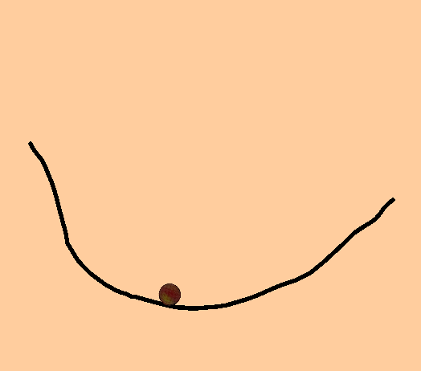

# Drawing Project
Drawing via mouse on computer (via finger on mobile devices) and automatically converting sketch into an interactable game object via Unity. You can draw as many lines as you want after game starts.

## Screenshot 
Drawing an individual line which interacts with ball object

## Game Keyboards
- Left mouse button click for drawing a dot.
- Holding left mouse button for drawing any shape.

## Contacts 
- E-mail address orkhan.elchuev@gmail.com
- https://github.com/OrkhanElchuev/Drawing_Project
